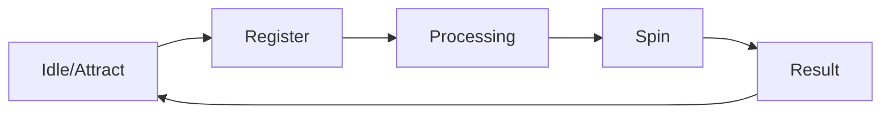

# 🖥️ Interactive Kiosk Core Engine


A high-performance, viewport-locked Progressive Web Application (PWA) engineered for dedicated portrait-mode kiosk hardware (1080×1920). The architecture prioritizes deterministic state management, memory-efficient asset handling, and hardware-accelerated animations.

---

## 📐 System Architecture

The project follows a modular, state-driven architecture designed to minimize re-render cycles.

```text
src/
├── components/      # Stateless and container UI components
├── context/         # Centralized state machine (useReducer + persistence)
├── hooks/           # Hardware-interfacing hooks (Web Audio API, Idle timers)
├── App.jsx          # Root layout & route guard
└── index.css        # PostCSS / Tailwind JIT configuration

```

### 🧠 State Machine Logic



State is managed via `React Context` combined with `localStorage` persistence, ensuring the application maintains data integrity across power cycles or browser refreshes.

---

## 🛠️ Technical Specifications

### Deterministic Spin Engine

* **Physics Simulation:** Uses arc-geometry calculations and easing functions to map input velocity to wheel rotation.
* **Audio Synthesis:** Employs the `Web Audio API` for procedural tick generation, eliminating the latency and memory overhead of `.mp3` or `.wav` decoding.

### UI & Layout

* **Viewport Locking:** Forced portrait resolution (9:16) with strict CSS containment to prevent overflow and scroll-jacking on restricted kiosk browsers.
* **Performance:** Utilizes `will-change: transform` and `requestAnimationFrame` for stutter-free 60fps animations.

### Data Handling

* **Asynchronous Export:** Encapsulated CSV generation logic.
* **Validation:** Robust client-side schema validation on the registration payload.

---

## 🚀 Development Workflow

### Installation

```bash
git clone <repository-url>
cd kiosk-engine
npm install

```

### Script Commands

* `npm run dev` — Spin up local development server with HMR.
* `npm run build` — Compile production-optimized, tree-shaken bundles.
* `npm run preview` — Validate production build locally.

---

## 🛡️ Administrative Interface

The system includes an obfuscated administrative gateway.

1. **Trigger:** Execute a triple-tap gesture on the designated `top-right` coordinate grid.
2. **Payload:** Access the raw lead-capture buffer.
3. **Extraction:** Triggers a blob-based CSV download of the `localStorage` payload.

**Schema Definition:**

```json
{
  "uuid": "string",
  "timestamp": "ISO8601",
  "data": { "name": "string", "mobile": "string", "email": "string" },
  "result": "string"
}

```

---

## ⚙️ Configuration Stack

| Subsystem | Tooling |
| --- | --- |
| **Logic Layer** | React 19 (Hooks/Context) |
| **Build Tooling** | Vite 8.x |
| **Style JIT** | Tailwind CSS 4.x |
| **Animation Engine** | Framer Motion 12.x |
| **Data Persistence** | LocalStorage API |
| **Deployment** | Static Hosting (Nginx / Vercel / Netlify) |

---

## 📜 License

*Proprietary code. All rights reserved.*

```

```